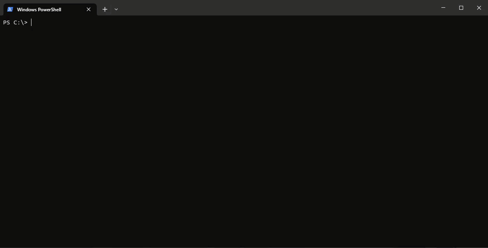

# AI CLI Assistant

[](https://pkg.go.dev/github.com/jo-hoe/ai-cli-assistant)
[](https://github.com/jo-hoe/ai-cli-assistant/actions?workflow=test)
[](https://coveralls.io/github/jo-hoe/ai-cli-assistant?branch=main)
[](https://github.com/jo-hoe/ai-cli-assistant/actions?workflow=lint)
[](https://github.com/jo-hoe/ai-cli-assistant/actions?workflow=CodeQL)
[](https://goreportcard.com/report/github.com/jo-hoe/ai-cli-assistant)

Provides CLI commands based on natural language using GenAI.
The tool is platform and CLI independent (works on Mac, Windows, and Linux).



## Prerequisites

- Go 1.20+
- An [OpenAI API key](https://platform.openai.com/account/api-keys)

## Build

Build the CLI binary from the entrypoint package:

```bash
go build -o ai-cli-assistant ./cmd/ai-cli-assistant
```

## Run

Set your OpenAI API key as environment variable OPENAI_API_KEY.

Windows (PowerShell):

```powershell
$Env:OPENAI_API_KEY = "sk-..."
# optional: set CLI kind to tailor wording (e.g., powershell, bash, kubectl)
$Env:CLI_KIND = "powershell"

.\ai-cli-assistant "list all folders in this folder"
```

macOS/Linux (bash/zsh):

```bash
export OPENAI_API_KEY="sk-..."
# optional:
export CLI_KIND="bash"

./ai-cli-assistant "list all folders in this folder"
```

You can also run without building:

```bash
go run ./cmd/ai-cli-assistant "list all folders in this folder"
```

## Testing

Run all tests:

```bash
go test ./...
```
